# Step 6: Run the BikeNodePlanner evaluation in QGIS, and explore results

Once you have:

✔️ downloaded the repository contents ([Step 01](../README.md#step-1-download-the-contents-of-this-repository)),

✔️ installed the necessary software ([Step 02](../README.md#step-2-software-installations)),

✔️ prepared your input data ([Step 03](../README.md#step-3-prepare-your-data)),

✔️ customized your user settings ([Step 04](../README.md#step-4-customize-your-user-settings)), and

✔️ opened the `workflow.qgz` file in QGIS ([Step 05](../README.md#step-5-open-workflowqgz-in-qgis)),

you can now run the BikeNodePlanner analysis in QGIS.

There are several analysis steps. For each step, you need to run one Python script in QGIS. The Python scripts are located in `/bike-node-planner/scripts/`. Running each script produces some visual output in your QGIS project, and/or plots and statistics that will be saved to your local machine.

Below, you find:

* general instructions on how to run a Python script in QGIS;
* for each script of the BikeNodePlanner, explanations of its output and how to interpret it.

***

## Running a Python script in QGIS

In QGIS,

1. Open the Python Console 
2. Click on `Show Editor`
3. Click on `Open Script`
4. Navigate to the `scripts` subfolder (within the `bike-node-planner` folder)
5. Select the next script (by number: 00, then 01, ...)
6. Click on `Open`
7. Click on `Run`.
8. While the script is running, check the console window for status messages.
9. Once you see the message `Script XXX ended successfully` in the console window, save the project (disquette icon or `cmd+s`). You can now explore the outputs of the script; use the `Layer overview` to navigate between different layers.
10. To get more information on a particular feature on the map, use the ["Identify features"](https://docs.qgis.org/3.34/en/docs/user_manual/introduction/general_tools.html#identify) tool in QGIS.

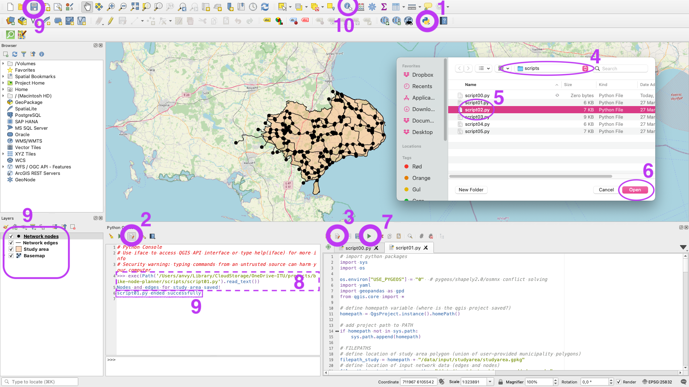

## Troubleshooting

* Note that QGIS might become unresponsive for several minutes while a script is running. 
* At any stop in the workflow, you can save the QGIS project, close it, and then come back to it later.
* Note that for some of the scripts, a stable internet connection is required.
* If `script03.py` (elevation analysis) fails to run - please try again! (it sometimes requires several attempts)
* if a script fails to complete and throws an error message:
    * save, close, and reopen the QGIS project
    * try to run the script again
    * if the problem persists: create a new QGIS project in the `bike-node-planner` folder and restart the workflow there from script 00

***

# The BikeNodePlanner scripts: Output and interpretation

The BikeNodePlanner consists of several scripts, which have to be run in the specified order. Below, you find explanations on each scripts' analysis, output, and how to interpret the corresponding results.

***

<!-- ## `script00.py`: Checking input data

script00 checks for correctness of all data. When you run this script, warnings, error messages, and instructions on how to correct your input data will be printed out in Python console. If needed, correct your input data and run the script00 again. -->

<!-- **Once you see the message `All input data is correct`, you can move on to the next script, script01.** -->

<!-- **TODO insert screenshot**

 -->

<!-- *** -->

## `script01.py`: Visualization of the study area

script01 plots the study area and a basemap from OpenStreetMap, and extracts the input network data to only include features that intersect with the study area.

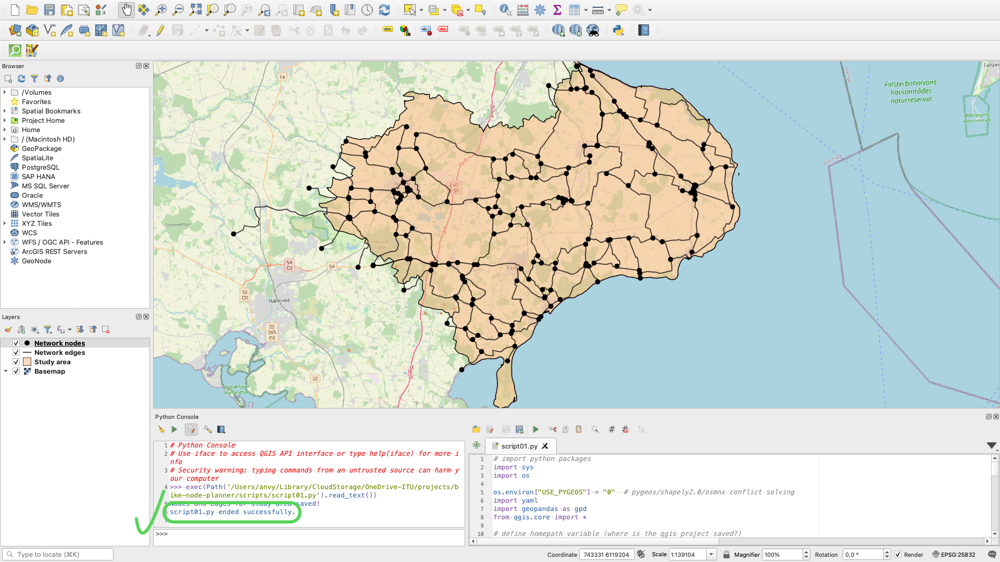

**Once you see the message `script01.py ended successfully`, you can move on to the next script.**

****

## `script02.py`: Network evaluation

Script02 conducts a qualitative network evaluation, using the point and polygon layers provided in `/data/input/point/` and `/data/input/polygon/` and the user-defined buffer thresholds provided in `config/config-point.yml` and `config/config-polygon.yml`, respectively.

For each **point layer**, the BikeNodePlanner checks and displays whether the points are within or outside of reach, based on the maximum distance defined by the user in `config-point.yml`. 

For each **polygon layer**, the BikeNodePlanner finds the parts of the network that run _through_ the layer, including a buffer distance defined by the user in `config-polygon.yml`.

You can explore the results of the evaluation by (de)selecting layers in the QGIS project. For example, if you have provided a polygon layer `nature.gpkg`, you can now select "Nature/Network in nature areas" within the "Evaluate network" layer to explore which parts of the network run through the nature layer. Or, if you have provided a point layer `museums.gpkg`, you can now select "Museums" within the "Evaluate network" layer to explore which museums within vs. outside reach (dark vs. light color) of the network.

> **Note:** This script can take a few minutes to run, during which time QGIS will appear to have frozen ❄️ - no need to worry!

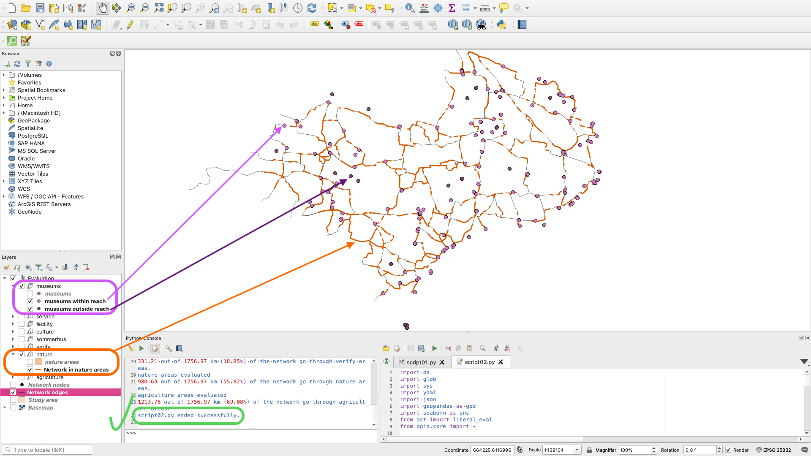

**Once you see the message `script02.py ended successfully`, you can move on to the next script.**

***

## `script03.py`: Elevation (slope)

> Note: this script is optional. If you didn't provide any elevation data, you can skip this script.

script03 uses the elevation data provided in `data/input/dem/` and the user-defined settings in `config/config-slope.yml` to compute the slope of the network.

To compute the slope, each edge is split into segments of configurable length (default setting: 100m). The results are presented for each segment (segment layer), and as the average slope for each edge (edge layer). Finally, segments with a slope above a maximum threshold are displayed as a separate layer.

The BikeNodePlanner classifies segments/edges into 4 different classes:

* Manageable elevation (default setting: 0 - 2% slope)
* Noticeable elevation (default setting: 2 - 4% slope)
* Steep elevation (default setting: 4 - 6% slope)
* Very steep elevation (default setting: over 6% slope)

**Use segment slope for a detailed overview of where the steepest stretches are located:**

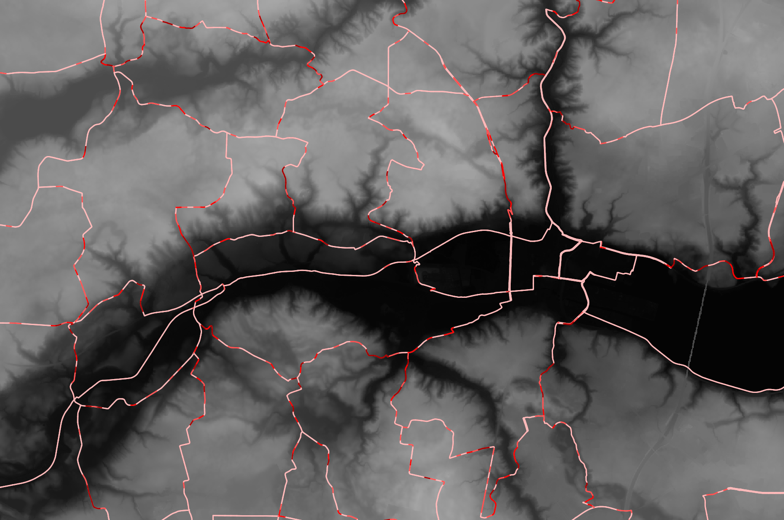

**Use edge slope for an overview of the average slope for each network edge:**

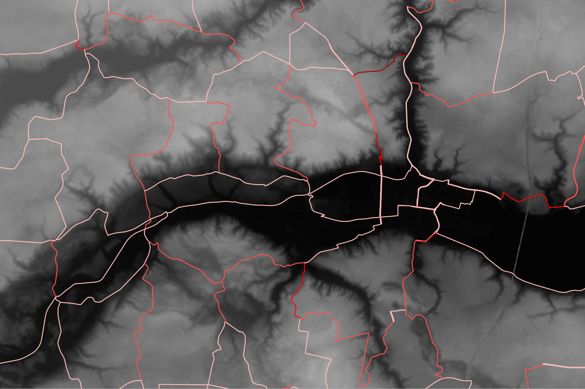

**Once you see the message `script03.py ended successfully`, you can move on to the next script.**

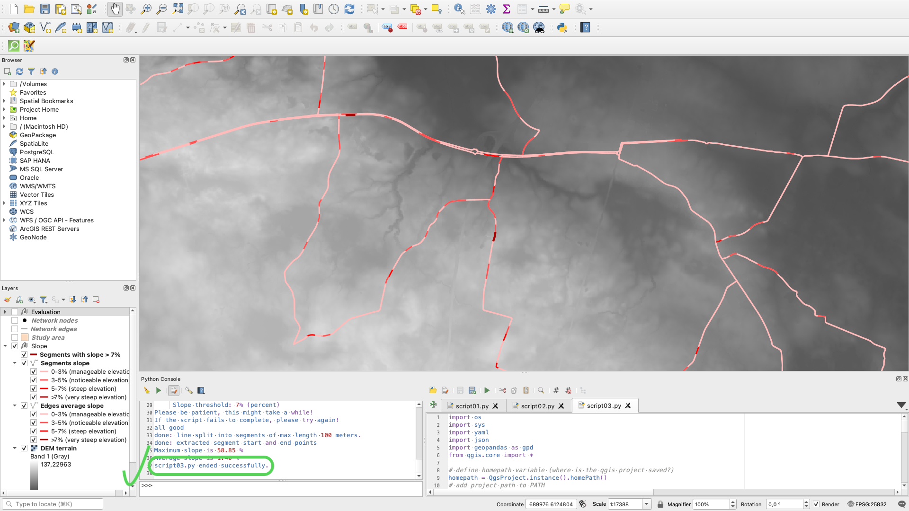

***

## `script04.py`: Disconnected components and network analysis

script04 converts the input data into a network (graph) object. Then, network statistics are computed and visualized: the numerical results are saved to `results/stats/stats_network.json`, and the plots to `results/plots/stats_network.png`. Script04 also identifies disconnected components in the network. The output layer of script04 displayed in QGIS shows each disconnected component as separate layer with a different color: 

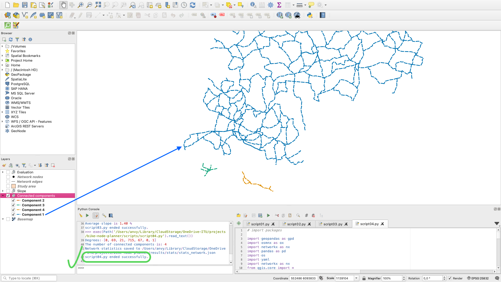

A separate plot of each component is also saved to `results/plots/`:

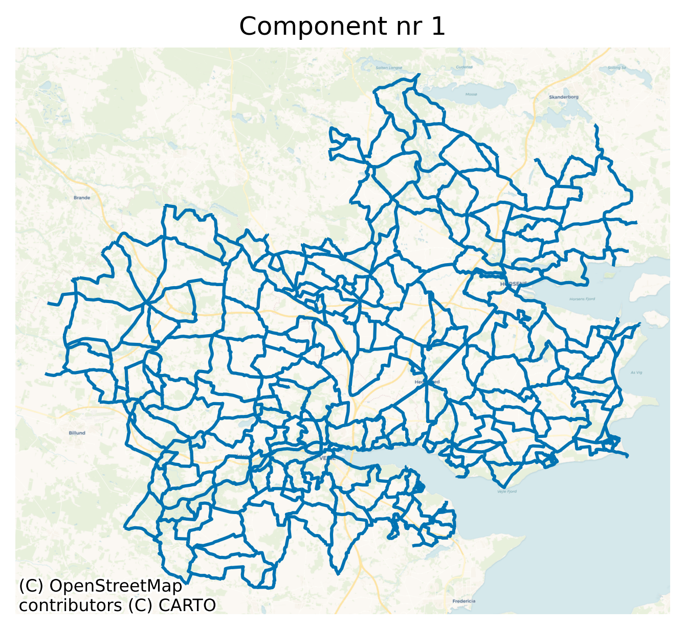

**Once you see the message `script04.py ended successfully`, you can move on to the next script.**

***

## `script05.py`: Edge length classification

Script05 evaluates network edge lengths, using processed network data provided in `data/input/network/processed/` and user-defined length evaluation thresholds provided in `config/config-topological-analysis.yml`.

For **edge length**, the BikeNodePlanner checks and displays for each edge whether it is beyond/within/above the ideal length range (default setting: 1-5km), and whether it exceeds the maximum length threshold (default setting: 10km).

***

## `script06.py`: Loop length classification

Script06 evaluates network loop lengths, using processed network data provided in `data/input/network/processed/` and user-defined length evaluation thresholds provided in `config/config-topological-analysis.yml`.

For **loop length**, the BikeNodeplanner checks and displays for each loop whether its length (perimeter) is beyond/within/above ideal length range (default setting: 8-20km).

***

## `script07.py`: Summary statistics

script07 generates summary statistics plots and saves them to `/bike-node-planner/results/plots/*.png`. 

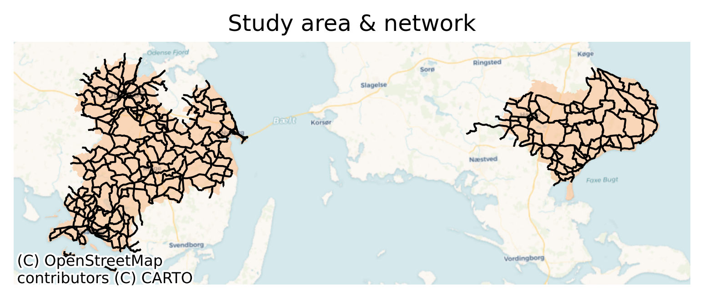

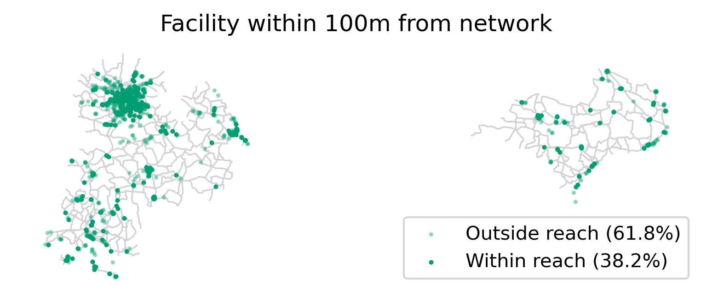

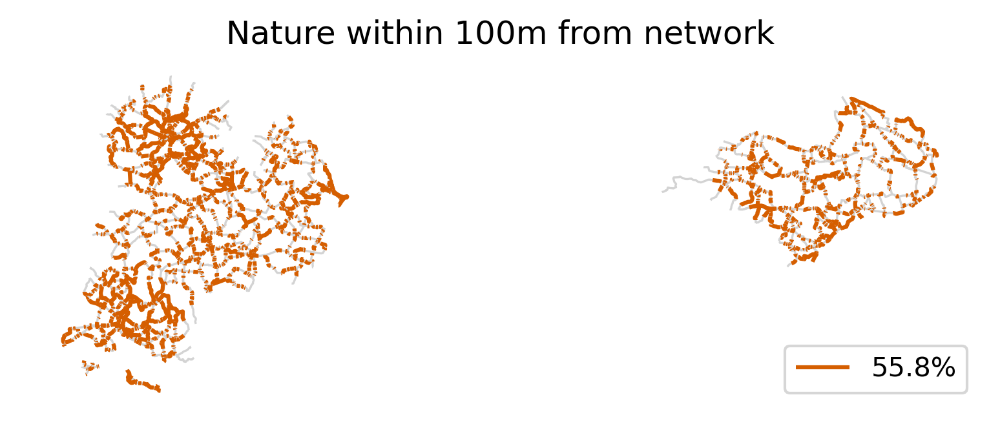

Summary statistics can also be found in `.json` format in the `/bike-node-planner/results/stats/` folder:
* `stats_evaluation.json`: summary statistics for each evaluation layer (for point layers: number of points within/outside of distance threshold; for polygon layers: length of network within/outside of polygon layer)
* `stats_slope.json`: length and slope for each segment, plus minimum, maximum, and average threshold for entire network
* `stats_network.json`: number of nodes and edges; number of disconnected components; degrees for all nodes

## `script08.py`: Export map layouts

script08 exports map layouts to `bike-node-planner/results/plots/*_qgis.png`. After running the script, the folder will contain a number of maps with the results of the network evaluation. To customize the number of exported maps and which layers to include in each map, update `layout_dict` in script08. Each dictionary item creates a new map export. The dictionary key specifies the map name, while the lists in the dictionary values refers to names of the layers included in each map.